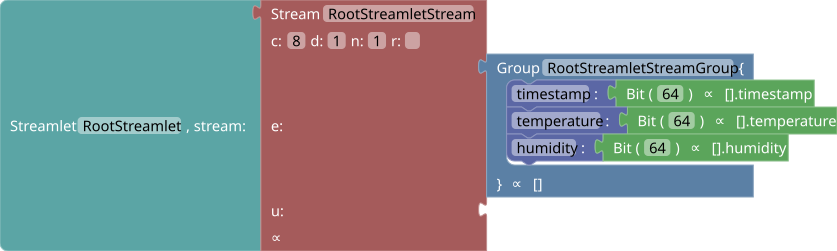
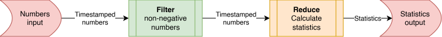

# Tydi

In this tutorial you will learn about Tydi and the accompanying tools step by step through examples. For a top-down read-trough of what Tydi is and how types are built up, see the [Understanding Tydi page](https://abs-tudelft.github.io/docs/tydi/what-is-tydi/) of the documentation.

## The Tydi protocol
### A simple stream

For our first stream, we will take a look at a data stream as one could receive from a minimal weather station with temperature and humidity sensor. Its data might look like:

```json
[
  {
    "timestamp": 1773068058000,
    "temperature": 21.5,
    "humidity": 45.2
  },
  {
    "timestamp": 1773068118000,
    "temperature": 21.8,
    "humidity": 44.8
  },
  {
    "timestamp": 1773068178000,
    "temperature": 22.1,
    "humidity": 44.5
  }
]
```

We will convert this data type to a Tydi structure to understand the mapping process and get an idea of what a stream is. For this, [open the example in the Tydi Stream Visualizer](https://abs-tudelft.github.io/tydi-stream-vis/#input=%5B%0A%20%20%7B%0A%20%20%20%20%22timestamp%22%3A%201773068058000%2C%0A%20%20%20%20%22temperature%22%3A%2021.5%2C%0A%20%20%20%20%22humidity%22%3A%2045.2%0A%20%20%7D%2C%0A%20%20%7B%0A%20%20%20%20%22timestamp%22%3A%201773068118000%2C%0A%20%20%20%20%22temperature%22%3A%2021.8%2C%0A%20%20%20%20%22humidity%22%3A%2044.8%0A%20%20%7D%2C%0A%20%20%7B%0A%20%20%20%20%22timestamp%22%3A%201773068178000%2C%0A%20%20%20%20%22temperature%22%3A%2022.1%2C%0A%20%20%20%20%22humidity%22%3A%2044.5%0A%20%20%7D%0A%5D). The JSON code from above is pre-filled as data input. For more info, see [Appendix: Visualizer application](#visualizer-application).

In the **Tydi structure builder** panel, you will see something like this



Clearly, a `Group` is being created (analog to an object), with several fields (analog to the properties), each of which is a base number, and so emitted as `Bit` types. You can customize the bit-widths of the fields. For example, the float values for temperature and humidity might be a `single` (instead of `double`), and thus be `32` bits.

In the **stream visualizer** panel, our stream of 3 elements can be inspected. If you click one of the packets, the data in the source JSON (data import panel) will be highlighted and the **packet inspector** panel will automatically open. There the layout of the packet can be inspected together with its index and dimensionality information. If you click the last element (in pink), you will see that the dimensionality information indicates `1`, as it is the last element of the stream.

### Multidimensional data

For the next example, we will investigate how multi-dimensional data is transferred. For this, we have the sentence “She is a dolphin”. For the purpose of this example, we encode this sentence as an array of words, where each word is built up out of characters. This means, that the base type for our stream is a character. In JSON, we will encode the data as an array of strings though.
```json
["she", "is", "a", "dolphin"]
```
[Open in the stream visualizer](https://abs-tudelft.github.io/tydi-stream-vis/#input=%5B%22she%22%2C%20%22is%22%2C%20%22a%22%2C%20%22dolphin%22%5D)

This will give you the simple block structure shown below.


By default, strings get recognized as a stream of characters in the application. Because it is not just a string we want to transmit, but an *array* of strings, the dimensionality of the data is increased. In contrast to the previous example, this stream, by default, also has multiple lanes, to reduce the horizontal space required to view all the transfers in the **stream visualizer** panel. The panel shows each character sent over the bus. The end of each word is marked by a yellow element and the end of the entire sequence again pink. Click the elements to check out the `last` flags information of the packet.

### More complicated data
If you want to check out how more complicated data translates to a Tydi structure and what the packets would look like being sent over the various streams, you can check out one of the more complicated examples below ([chats example](#chats-with-messages-example), [student data with exam results](#student-data-analysis)), put in some data of your own project (the app operates fully client side), or generate some data you find interesting with an LLM. For this, you can use the following prompt format:
> *Write a code block with an example JSON structure representing [...]. The outer structure must be an array, not an object.*

## Tooling

The tooling available for code generation for Tydi interfaces and circuits comprises of two parts that will later be merged to a singular comprehensive toolset. One set of tools available creates the plumbing between components that are assumed to have a Tydi compliant interface. The other toolset, still in development, allows generating the actual interface logic based on the formalism to *ensure* a Tydi compliant interface, loosening the constraints to the developer to build components with Tydi interfaces.

### TinyTydi: generating interface implementations

> [!NOTE]
> As the [TinyTydi](https://gitlab.com/hstruik/tinytydi) project is still in development, it is included as a *submodule* in `tinytydi/`, instead of being baked in the docker image. If you followed the instructions in the [main readme](../README.md), the submodule should be initialized already. If not, run
> ```sh
> git submodule update --init tinytydi
> ```
> or
> ```sh
> .devcontainer/bootstrap.sh
> ```

#### Summary
This set of tools is centred around an executable version of the semantics, simulating an interface, illustrating how for a given type it iteratively maps elements onto transfers.
By supplying an intialized `JSON` object, the tool can derive the Tydi-type equivalent, normalize it and apply the simulation of the interface *to* the data elements. 
This way, you can visualize how the formalism would transmit your json object over the wire. 
Furthermore, since a set of input streams has a strict 1-to-1 correspondence of the output stream, the simulated trace can be used to *verify* the hardware implementation. 
By invoking the export funcitonality, the toolset can export implementation tables, which can be interpredted by our Chisel implementation, to generate the actual HDL that implements an interface of the provided type and behavior. 
> It is worth noting that this integration is intended for the tutorial illustration purposes, whereas a fully fledged generator tooling would generate the Chisel directly from the formal implementation. The tutorial implementation results in quite a few additional signals and debug probes that would be undesirable in an actual implementation.

#### Preparation
The dev container runs `.devcontainer/bootstrap.sh` on creation, which checks out the submodule and builds the stimulus bundles the Chisel tests read. If you skipped the container, run the bootstrap script by hand as well.

```sh
bash .devcontainer/bootstrap.sh
```

#### Example
Everything in this section runs from the `tinytydi/` directory, so go there
first.
```sh
cd tinytydi
```

Start with the chat message example from the paper and the presentation. 

```sh
./main.py example
```

It steps the semantics one <kbd>Enter</kbd> at a time, redrawing the input registers, the
parse tree, the lane buffers and the transfers so far after every step, with the
rule that fired named above them. Characters appear as letters rather than
bytes, with the *dimension they close* in brackets. The 13 characters of the
message take roughly forty steps.

This repository's own [`tydi-material/chat-messages/chat-messages.json`](../tydi-material/chat-messages/chat-messages.json) is a slight expansion of the worked example, adding `user id` and `message id`. 

```sh
python3 ./main.py json ../tydi-material/chat-messages/chat-messages.json --type-only
```

This JSON is mapped to the Tydi type  
$Dim(Group(Bits(64), Dim(Group(Bits(32), Bits(16), Bits(16), Dim(Dim(Bits(8)))))))$  
and normalises to three physical streams:
1. The chat id
2. A 64-bit payload packing `timestamp`, `message_id` and `user_id` together
3. The message characters at dimension 4.

Per stream it also prints the width, the dimension, which JSON
fields feed it, and how many elements it carries. Without `--type-only` the
document's own data is run through the semantics as well, which prints the
dashboard described below and a transfer count for the whole document.

Of note, the simulator currently does not support the $Union$ type. This means nullable fields and variant types in JSON schema cannot be translated to their Tydi equivalent. 
The [student example](#student-data-analysis) ([`tydi-material/student-example/student.json`](../tydi-material/student-example/student.json)) is an example and deliberately *not* accepted:
its `"study_end": null` is an optional, which is a `Union` of the value and nothing.

> [!NOTE]
> `hdl/invoke-surfer` is not the `invoke-surfer` in this repository's root
> (`../invoke-surfer` from here). The root script drives the ChiselTrace sample
> circuits; the TinyTydi one takes a bundle name and reports whether Tywaves
> type information was found.

#### From JSON to a waveform

Seeing the formalism in action in the terminal is fun, but we also mentioned that the tool can build a real RTL interface that can be simulated. To build the interface and view how the interface operates in the waveform viewer, follow these steps:

```sh
# 1. Derive the Tydi type of the document: three physical streams, with the
#    message text as 8-bit elements at dimension 4.
python3 ./main.py json ../tydi-material/chat-messages/chat-messages.json --type-only

# 2. Turn it into a stimulus bundle: the parameters the circuit is elaborated
#    from, the elements themselves, and the cycle-by-cycle trace to check against
python3 ./main.py export --json ../tydi-material/chat-messages/chat-messages.json \
                                --lanes 1,2,4 --out hdl/bundles/chatmsgs

# 3. Elaborate the interface for that type and simulate it (about 20 s warm).
#    Steps 3 and 4 resolve their paths against the working directory, so from
#    here on you are in hdl/ rather than in tinytydi/.
cd hdl
scala-cli test .

# 4. open the waveform with the characters already on it
./invoke-surfer chatmsgs --chars
```

*Step 4* prints `Tywaves: on (typed hgldd: ...)` before it opens anything. On
anything else the waveform still opens, but without type information, and the
line states which of the two reasons applies.

The character rows are loaded, but as numbers. Right-click a `value` row and set
Format to Tywaves ASCII to read them as characters. This cannot be preselected from the
command line.

Expand `outStream_2` to see the four character lanes fill up. `strb` and `endi`
mark how many lanes carry data in a transfer, and `last(i)` closes dimensions,
one bit per dimension: a lane that ends a word sets bit 0, a lane that ends a
message sets bits 0 and 1, and so on outwards. `in_2` above it shows the element
side, one character per cycle. `_state_output` below it is the parse FSM, one
bit per node of the normalised type, all of them set on the cycle `fullMap`
fires.

The same works for any accepted document. Run `python3 ./main.py export --json
yours.json --lanes 1,2,4 --out hdl/bundles/yours` from `tinytydi/`, after which
`scala-cli test .` in `hdl` picks the new bundle up on its own, because every
directory under `bundles/` is a test case.

[`hdl/README.md`](../tinytydi/hdl/README.md) further describes the method for generating the hardware.

#### Other subcommands

`./main.py` without arguments lists them. Besides `example`, `json` and
`export`:

- `simulate` is the same machinery with every choice open. Without options it
  prompts for type, lanes, ruleset and mode, and `?` at a prompt explains that
  choice. `--mode all` enumerates every admissible order in which the internal
  streams can terminate and runs each of them, `--mode random` runs a single
  instance and is the one to combine with `--interactive`. `--ruleset core`
  swaps P_C3 for P_core, which terminates transfer buffers on the outermost
  dimension only.
- `fsm` derives the control loop of the interface from the type directly,
  without simulating. A state is the set of terminated parse tree nodes at a
  cycle boundary, an edge is one cycle. It prints the states and transitions as
  a table, and `--out` writes a Graphviz and a Mermaid version. The size of the
  machine indicates what the type hierarchy and the property set cost you in
  control logic.
- `normalise` prints the reduction from the surface type to the normalized type
  one rewrite at a time. It is also the quickest way to count the physical
  streams of a type, which is how many values `--lanes` expects.

### Circuit assembly by composition with Tydi

This section provides material for experimenting with the dataflow routing boilerplate generation tooling of Tydi. All code that is referenced can be found in the `tydi-material` folder.

#### Pipeline example

This example comes from the original [Tydi-Chisel library](https://github.com/abs-tudelft/tydi-chisel) and the conference and journal publications. The idea is that we create a simple streaming pipeline that transforms some data. Specifically, we take in a *stream of numbers with timestamps attached*. This stream first gets filtered on $value\geq0$ and then reduced to statistics: min value, max value, sum of values, and average. The block schedule for this system is as follows:



##### **Tydi-lang**

The example starts with a description of the streams and streamlets in Tydi-lang.

```jsx
#### package pack0;
UInt_64_t = Bit(64); // UInt<64>
SInt_64_t = Bit(64); // SInt<64>

Group NumberGroup {
    value: SInt_64_t;
    time: UInt_64_t;
}

Group Stats {
    average: UInt_64_t;
    sum: UInt_64_t;
    max: UInt_64_t;
    min: UInt_64_t;
}

NumberGroup_stream = Stream(NumberGroup, t=1.0, d=1, c=1);
Stats_stream = Stream(Stats, t=1.0, d=1, c=1);

#### package pack1;
use pack0;

streamlet NumsFilter_interface {
    std_out : pack0.NumberGroup_stream out;
    std_in : pack0.NumberGroup_stream in;
}

impl NonNegativeFilter of NumsFilter_interface {}

streamlet NumsToStats_interface {
    std_out : pack0.Stats_stream out;
    std_in : pack0.NumberGroup_stream in;
}

impl Reducer of NumsToStats_interface {}

impl PipelineExample of NumsToStats_interface {
    instance filter(NonNegativeFilter);
    instance reducer(Reducer);
    filter.std_out => reducer.std_in;
    reducer.std_out => self.std_out;
    self.std_in => filter.std_in;
}
```

You can, from the `tydi-material/pipeline-example` folder, generate the Tydi-lang IR data with
```sh
tydi-lang-complier -c pipeline-example.toml
```

Then, you can generate Chisel code for this Tydi dataflow description with

```sh
tl2chisel output output/json_IR.json
```

This will generate three Chisel files in the `output` folder. The `main` file contains the definition of the top level component and all data types and interfaces (streamlet definitions in Tydi-lang jargon). The `components` file contains bare, stream routing only, implementations as defined in the Tydi-lang description. This is done in a separate file, so they can be swapped out with _real_ implementations easily from another file, without hazard of important code being overwritten. Finally, there is the `generation_sub`, which contains an `App` class that can be run to generate output Verilog code. 

Finally you can generate Verilog output with

```sh
scala-cli output/json_IR_generation_stub.scala output/json_IR_main.scala
```

The folder also contains handwritten versions in Chisel to show what an optimised code that uses library utilities looks like. There is a single-lane and multi-lane version.

##### **Tydi type**

The Tydi type that corresponds to the number stream is as follows:

$Stream(t=Group(Bits(64), Bits(64)), d=1)$

Or, expressed in the syntax of the Tydi formalism: $Dim(Group(Bits(64), Bits(64)))$

##### **Data**

Some example data can be generated with the following JavaScript method. Below this block is some pre-generated data.

```jsx
function generateDataWithStats(count = 20) {
  const input = [];
  
  // 1. Generate random input data
  for (let i = 1; i <= count; i++) {
    const randomValue = Math.floor(Math.random() * 101) - 50; 
    input.push({
      value: randomValue,
      time: i
    });
  }

  // 2. Filter for values >= 0
  const validValues = input
    .map(item => item.value)
    .filter(val => val >= 0);

  // 3. Calculate statistics with specific edge cases
  if (validValues.length === 0) {
    return {
      input,
      output: {
        average: 0,
        sum: 0,
        max: 0,
        min: Number.MAX_SAFE_INTEGER // 9007199254740991
      }
    };
  }

  const sum = validValues.reduce((acc, curr) => acc + curr, 0);
  
  return {
    input,
    output: {
      average: Math.floor(sum / validValues.length), // Integer division (floor)
      sum: sum,
      max: Math.max(...validValues),
      min: Math.min(...validValues)
    }
  };
}

console.log(JSON.stringify(generateDataWithStats(20)));
```

A few runs of this produces:

```jsx
{
  "input": [{"value":-22,"time":1},{"value":31,"time":2},{"value":-35,"time":3},{"value":-40,"time":4},{"value":23,"time":5},{"value":10,"time":6},{"value":-3,"time":7},{"value":39,"time":8},{"value":15,"time":9},{"value":40,"time":10},{"value":-44,"time":11},{"value":-15,"time":12},{"value":31,"time":13},{"value":-45,"time":14},{"value":-37,"time":15},{"value":-35,"time":16},{"value":-40,"time":17},{"value":38,"time":18},{"value":-32,"time":19},{"value":-31,"time":20}],
  "output": {"average":28,"sum":227,"max":40,"min":10}
}
{
  "input": [{"value":-8,"time":1},{"value":17,"time":2},{"value":-39,"time":3},{"value":-40,"time":4},{"value":6,"time":5},{"value":5,"time":6},{"value":-41,"time":7},{"value":-6,"time":8},{"value":37,"time":9},{"value":1,"time":10}],
  "output": {"average":13,"sum":66,"max":37,"min":1}
}
{
  "input": [{"value":20,"time":1},{"value":30,"time":2},{"value":40,"time":3},{"value":-36,"time":4},{"value":-37,"time":5},{"value":21,"time":6},{"value":44,"time":7},{"value":31,"time":8},{"value":27,"time":9},{"value":-34,"time":10},{"value":28,"time":11},{"value":30,"time":12},{"value":-1,"time":13},{"value":17,"time":14},{"value":-26,"time":15}],
  "output":{"average":28,"sum":288,"max":44,"min":17}
}
```

Transforming this into lists of intputs and outputs gives the following arrays:

**Inputs**

```js
[
  [{"value":-22,"time":1},{"value":31,"time":2},{"value":-35,"time":3},{"value":-40,"time":4},{"value":23,"time":5},{"value":10,"time":6},{"value":-3,"time":7},{"value":39,"time":8},{"value":15,"time":9},{"value":40,"time":10},{"value":-44,"time":11},{"value":-15,"time":12},{"value":31,"time":13},{"value":-45,"time":14},{"value":-37,"time":15},{"value":-35,"time":16},{"value":-40,"time":17},{"value":38,"time":18},{"value":-32,"time":19},{"value":-31,"time":20}],
  [{"value":-8,"time":1},{"value":17,"time":2},{"value":-39,"time":3},{"value":-40,"time":4},{"value":6,"time":5},{"value":5,"time":6},{"value":-41,"time":7},{"value":-6,"time":8},{"value":37,"time":9},{"value":1,"time":10}],
  [{"value":20,"time":1},{"value":30,"time":2},{"value":40,"time":3},{"value":-36,"time":4},{"value":-37,"time":5},{"value":21,"time":6},{"value":44,"time":7},{"value":31,"time":8},{"value":27,"time":9},{"value":-34,"time":10},{"value":28,"time":11},{"value":30,"time":12},{"value":-1,"time":13},{"value":17,"time":14},{"value":-26,"time":15}]
]
```

**Outputs**
```js
[
  {"average":28,"sum":227,"max":40,"min":10},
  {"average":13,"sum":66,"max":37,"min":1},
  {"average":28,"sum":288,"max":44,"min":17}
]
```

These can be inserted in separate instances of the visualizer. For the input, the number of lanes (`n`) should be a bit higher, so there is more overview.

##### **Exercises**

Insert the outputs and inputs into separate instances of the visualizer and analyse the structure and packets.

##### **Chisel**

When the Tydi-lang code is transpiled to Chisel code, the following is obtained.

```scala
// Based on transpile output

/** Implementation, defined in pack1. */
class NonNegativeFilter extends NonNegativeFilter_interface {
	outStream := inStream
  outStream.strb := inStream.strb(0) && inStream.el.value >= 0.S
}

/** Implementation, defined in pack1. */
class PipelineExample extends PipelineExample_interface {
    // Modules
    val filter = Module(new NonNegativeFilter)
    val reducer = Module(new Reducer)

    // Connections
    reducer.in := filter.out
    out := reducer.out
    filter.in := in
}

```

A more compact version can be obtained when utility classes are used.

```scala
// Using utility classes

/** A module based on a stream-processing base with input and output streams of type `NumberGroup`.
  * Input and output streams are passthrough-connected by default so only meaningful signals are overridden.
  */
class NonNegativeFilter extends SubProcessorBase(new NumberGroup, new NumberGroup) {
  outStream.strb := inStream.strb(0) && inStream.el.value >= 0.S
}

/** Using the stream processing modules with chaining syntax.
  * SimpleProcessorBase is similar to SubProcessorBase but
  * does not expose the detailed Stream content signals. */
class PipelineExampleModule extends SimpleProcessorBase(new NumberGroup, new Stats) {
  out := in.processWith(new NonNegativeFilter).processWith(new Reducer())
}
```

#### Student data analysis

A more advanced example is a dataset of students and their exam results. This example also comes from the original [Tydi-Chisel library](https://github.com/abs-tudelft/tydi-chisel) and the journal publication. A lot of streams are involved, because the data contains a lot of strings, and each string is a sequence of unknown runtime length.

##### **JSON data**

The data looks like this

Snippet of [`tydi-material/student-example/student.json`](../tydi-material/student-example/student.json)
```json
[
  {
    "student_number": "S123456789",
    "name": "John Doe",
    "birthdate": "2000-05-15",
    "study_start": "2021-05-15",
    "study_end": null,
    "study": "Computer Science",
    "email": "john.doe@example.com",
    "exams": [
      {
        "course_code": "CS101",
        "course_name": "Introduction to Computer Science",
        "exam_date": "2023-12-10",
        "grade": 80
      },
      {
        "course_code": "MATH201",
        "course_name": "Calculus",
        "exam_date": "2023-12-15",
        "grade": 60
      }
    ]
  }
  // Other students
]
```

It should be noted that this example does not give the most interesting streaming type, as nesting depth is limited of both the groups and the streams. The most interesting data is probably the strings within the exams info, because they are 3<sup>rd</sup> dimension data, resulting in more complex relationships between an element and its role in the ending of sequences.

#### Chats with messages example

An example that shows various interesting aspects of Tydi’s typing and protocol is a list of chats that each contain messages with some metadata and text that is split up in words. This means that the characters in the messages are 4-dimensional data elements (chats→messages→words→characters). The first and second dimension elements carry some metadata about respectively the chats and the messages.

[Open example in the stream visualizer](https://abs-tudelft.github.io/tydi-stream-vis/#input=%5B%0A%20%20%7B%0A%20%20%20%20%22chat_id%22%3A%20102938475612345678%2C%0A%20%20%20%20%22messages%22%3A%20%5B%0A%20%20%20%20%20%20%7B%0A%20%20%20%20%20%20%20%20%22timestamp%22%3A%201712052000%2C%0A%20%20%20%20%20%20%20%20%22message_id%22%3A%209001%2C%0A%20%20%20%20%20%20%20%20%22user_id%22%3A%201001%2C%0A%20%20%20%20%20%20%20%20%22words%22%3A%20%5B%22Shall%22%2C%20%22we%22%2C%20%22order%22%2C%20%22pizza%22%2C%20%22tonight%3F%22%5D%0A%20%20%20%20%20%20%7D%2C%0A%20%20%20%20%20%20%7B%0A%20%20%20%20%20%20%20%20%22timestamp%22%3A%201712052060%2C%0A%20%20%20%20%20%20%20%20%22message_id%22%3A%209002%2C%0A%20%20%20%20%20%20%20%20%22user_id%22%3A%201002%2C%0A%20%20%20%20%20%20%20%20%22words%22%3A%20%5B%22Sure%2C%22%2C%20%22I%22%2C%20%22would%22%2C%20%22love%22%2C%20%22some%22%2C%20%22Pepperoni.%22%5D%0A%20%20%20%20%20%20%7D%2C%0A%20%20%20%20%20%20%7B%0A%20%20%20%20%20%20%20%20%22timestamp%22%3A%201712052120%2C%0A%20%20%20%20%20%20%20%20%22message_id%22%3A%209003%2C%0A%20%20%20%20%20%20%20%20%22user_id%22%3A%201001%2C%0A%20%20%20%20%20%20%20%20%22words%22%3A%20%5B%22Great%2C%22%2C%20%22I%22%2C%20%22will%22%2C%20%22place%22%2C%20%22the%22%2C%20%22order%22%2C%20%22now.%22%5D%0A%20%20%20%20%20%20%7D%2C%0A%20%20%20%20%20%20%7B%0A%20%20%20%20%20%20%20%20%22timestamp%22%3A%201712052180%2C%0A%20%20%20%20%20%20%20%20%22message_id%22%3A%209004%2C%0A%20%20%20%20%20%20%20%20%22user_id%22%3A%201002%2C%0A%20%20%20%20%20%20%20%20%22words%22%3A%20%5B%22Don't%22%2C%20%22forget%22%2C%20%22the%22%2C%20%22garlic%22%2C%20%22dipping%22%2C%20%22sauce!%22%5D%0A%20%20%20%20%20%20%7D%0A%20%20%20%20%5D%0A%20%20%7D%2C%0A%20%20%7B%0A%20%20%20%20%22chat_id%22%3A%20223344556677889900%2C%0A%20%20%20%20%22messages%22%3A%20%5B%0A%20%20%20%20%20%20%7B%0A%20%20%20%20%20%20%20%20%22timestamp%22%3A%201712138400%2C%0A%20%20%20%20%20%20%20%20%22message_id%22%3A%2012050%2C%0A%20%20%20%20%20%20%20%20%22user_id%22%3A%202005%2C%0A%20%20%20%20%20%20%20%20%22words%22%3A%20%5B%22Did%22%2C%20%22you%22%2C%20%22see%22%2C%20%22the%22%2C%20%22latest%22%2C%20%22rocket%22%2C%20%22launch%3F%22%5D%0A%20%20%20%20%20%20%7D%2C%0A%20%20%20%20%20%20%7B%0A%20%20%20%20%20%20%20%20%22timestamp%22%3A%201712138520%2C%0A%20%20%20%20%20%20%20%20%22message_id%22%3A%2012051%2C%0A%20%20%20%20%20%20%20%20%22user_id%22%3A%202006%2C%0A%20%20%20%20%20%20%20%20%22words%22%3A%20%5B%22The%22%2C%20%22booster%22%2C%20%22landing%22%2C%20%22was%22%2C%20%22incredible.%22%5D%0A%20%20%20%20%20%20%7D%2C%0A%20%20%20%20%20%20%7B%0A%20%20%20%20%20%20%20%20%22timestamp%22%3A%201712138600%2C%0A%20%20%20%20%20%20%20%20%22message_id%22%3A%2012052%2C%0A%20%20%20%20%20%20%20%20%22user_id%22%3A%202005%2C%0A%20%20%20%20%20%20%20%20%22words%22%3A%20%5B%22It%22%2C%20%22still%22%2C%20%22feels%22%2C%20%22like%22%2C%20%22science%22%2C%20%22fiction.%22%5D%0A%20%20%20%20%20%20%7D%2C%0A%20%20%20%20%20%20%7B%0A%20%20%20%20%20%20%20%20%22timestamp%22%3A%201712138700%2C%0A%20%20%20%20%20%20%20%20%22message_id%22%3A%2012053%2C%0A%20%20%20%20%20%20%20%20%22user_id%22%3A%202006%2C%0A%20%20%20%20%20%20%20%20%22words%22%3A%20%5B%22True%2C%22%2C%20%22the%22%2C%20%22reusability%22%2C%20%22is%22%2C%20%22a%22%2C%20%22game%22%2C%20%22changer.%22%5D%0A%20%20%20%20%20%20%7D%0A%20%20%20%20%5D%0A%20%20%7D%2C%0A%20%20%7B%0A%20%20%20%20%22chat_id%22%3A%20556677889900112233%2C%0A%20%20%20%20%22messages%22%3A%20%5B%0A%20%20%20%20%20%20%7B%0A%20%20%20%20%20%20%20%20%22timestamp%22%3A%201712224800%2C%0A%20%20%20%20%20%20%20%20%22message_id%22%3A%2033001%2C%0A%20%20%20%20%20%20%20%20%22user_id%22%3A%203001%2C%0A%20%20%20%20%20%20%20%20%22words%22%3A%20%5B%22Is%22%2C%20%22the%22%2C%20%22deployment%22%2C%20%22to%22%2C%20%22production%22%2C%20%22finished%3F%22%5D%0A%20%20%20%20%20%20%7D%2C%0A%20%20%20%20%20%20%7B%0A%20%20%20%20%20%20%20%20%22timestamp%22%3A%201712224900%2C%0A%20%20%20%20%20%20%20%20%22message_id%22%3A%2033002%2C%0A%20%20%20%20%20%20%20%20%22user_id%22%3A%203002%2C%0A%20%20%20%20%20%20%20%20%22words%22%3A%20%5B%22Yes%2C%22%2C%20%22all%22%2C%20%22unit%22%2C%20%22tests%22%2C%20%22passed%22%2C%20%22successfully.%22%5D%0A%20%20%20%20%20%20%7D%2C%0A%20%20%20%20%20%20%7B%0A%20%20%20%20%20%20%20%20%22timestamp%22%3A%201712224950%2C%0A%20%20%20%20%20%20%20%20%22message_id%22%3A%2033003%2C%0A%20%20%20%20%20%20%20%20%22user_id%22%3A%203001%2C%0A%20%20%20%20%20%20%20%20%22words%22%3A%20%5B%22Great%22%2C%20%22job%22%2C%20%22team!%22%5D%0A%20%20%20%20%20%20%7D%2C%0A%20%20%20%20%20%20%7B%0A%20%20%20%20%20%20%20%20%22timestamp%22%3A%201712225000%2C%0A%20%20%20%20%20%20%20%20%22message_id%22%3A%2033004%2C%0A%20%20%20%20%20%20%20%20%22user_id%22%3A%203003%2C%0A%20%20%20%20%20%20%20%20%22words%22%3A%20%5B%22I%22%2C%20%22am%22%2C%20%22monitoring%22%2C%20%22the%22%2C%20%22logs%22%2C%20%22now.%22%5D%0A%20%20%20%20%20%20%7D%2C%0A%20%20%20%20%20%20%7B%0A%20%20%20%20%20%20%20%20%22timestamp%22%3A%201712225100%2C%0A%20%20%20%20%20%20%20%20%22message_id%22%3A%2033005%2C%0A%20%20%20%20%20%20%20%20%22user_id%22%3A%203003%2C%0A%20%20%20%20%20%20%20%20%22words%22%3A%20%5B%22Everything%22%2C%20%22looks%22%2C%20%22stable%22%2C%20%22so%22%2C%20%22far.%22%5D%0A%20%20%20%20%20%20%7D%0A%20%20%20%20%5D%0A%20%20%7D%2C%0A%20%20%7B%0A%20%20%20%20%22chat_id%22%3A%20998877665544332211%2C%0A%20%20%20%20%22messages%22%3A%20%5B%0A%20%20%20%20%20%20%7B%0A%20%20%20%20%20%20%20%20%22timestamp%22%3A%201712311200%2C%0A%20%20%20%20%20%20%20%20%22message_id%22%3A%2055010%2C%0A%20%20%20%20%20%20%20%20%22user_id%22%3A%204001%2C%0A%20%20%20%20%20%20%20%20%22words%22%3A%20%5B%22I%22%2C%20%22started%22%2C%20%22reading%22%2C%20%22that%22%2C%20%22new%22%2C%20%22fantasy%22%2C%20%22novel.%22%5D%0A%20%20%20%20%20%20%7D%2C%0A%20%20%20%20%20%20%7B%0A%20%20%20%20%20%20%20%20%22timestamp%22%3A%201712311300%2C%0A%20%20%20%20%20%20%20%20%22message_id%22%3A%2055011%2C%0A%20%20%20%20%20%20%20%20%22user_id%22%3A%204002%2C%0A%20%20%20%20%20%20%20%20%22words%22%3A%20%5B%22The%22%2C%20%22world-building%22%2C%20%22is%22%2C%20%22absolutely%22%2C%20%22stunning.%22%5D%0A%20%20%20%20%20%20%7D%2C%0A%20%20%20%20%20%20%7B%0A%20%20%20%20%20%20%20%20%22timestamp%22%3A%201712311400%2C%0A%20%20%20%20%20%20%20%20%22message_id%22%3A%2055012%2C%0A%20%20%20%20%20%20%20%20%22user_id%22%3A%204001%2C%0A%20%20%20%20%20%20%20%20%22words%22%3A%20%5B%22Wait%22%2C%20%22until%22%2C%20%22you%22%2C%20%22get%22%2C%20%22to%22%2C%20%22chapter%22%2C%20%22five.%22%5D%0A%20%20%20%20%20%20%7D%2C%0A%20%20%20%20%20%20%7B%0A%20%20%20%20%20%20%20%20%22timestamp%22%3A%201712311500%2C%0A%20%20%20%20%20%20%20%20%22message_id%22%3A%2055013%2C%0A%20%20%20%20%20%20%20%20%22user_id%22%3A%204002%2C%0A%20%20%20%20%20%20%20%20%22words%22%3A%20%5B%22No%22%2C%20%22spoilers%22%2C%20%22please!%22%2C%20%22I%22%2C%20%22am%22%2C%20%22only%22%2C%20%22on%22%2C%20%22page%22%2C%20%22ten.%22%5D%0A%20%20%20%20%20%20%7D%0A%20%20%20%20%5D%0A%20%20%7D%0A%5D%0A)

##### **JSON**

Snippet of [`tydi-material/chat-messages/chat-messages.json`](../tydi-material/chat-messages/chat-messages.json)
```json
[
  {
    "chat_id": 102938475612345678,
    "messages": [
      {
        "timestamp": 1712052000,
        "message_id": 9001,
        "user_id": 1001,
        "words": ["Shall", "we", "order", "pizza", "tonight?"]
      },
      {
        "timestamp": 1712052060,
        "message_id": 9002,
        "user_id": 1002,
        "words": ["Sure,", "I", "would", "love", "some", "Pepperoni."]
      },
      {
        "timestamp": 1712052120,
        "message_id": 9003,
        "user_id": 1001,
        "words": ["Great,", "I", "will", "place", "the", "order", "now."]
      },
      {
        "timestamp": 1712052180,
        "message_id": 9004,
        "user_id": 1002,
        "words": ["Don't", "forget", "the", "garlic", "dipping", "sauce!"]
      }
    ]
  }
  // Other chats
]
```

##### **Exercises**

- Click on various elements in the **Tydi structure builder** or **stream visualizer** tab. Check out which elements they correspond to in the other tabs, such as the input data, or the Tydi structure (when clicking in the visualizer).
- Inspect the data packing of the message data. Change the bit widths in the block editor.
- Change the number of lanes of some streams.
- Inspect the dimensionality (`last` flags) information of the message text. Different sequence endings have different colours.

## Appendix
### Visualizer application

Access the Tydi visualizer application at [https://abs-tudelft.github.io/tydi-stream-vis/](https://abs-tudelft.github.io/tydi-stream-vis/).

It is meant to be used in the following way:

1. Insert `json` data containing an example of what you want to transfer in your hardware design
2. The data's data schema is extracted
3. A Tydi structure is created in the [Blockly](https://www.blockly.com/) canvas based on this data schema
    - Each element is given a path mapping to the original data
    - Nullable elements are converted to `Union`s
4. Each stream in the schema (corresponding to a sequence) is split into a separate *physical stream* and data packets are constructed based on the input data
5. Stream transfers are visualized using these data packets

To facilitate this, the app has several tabs:

- Data import: paste JSON content here
- Code generator: shows code for Tydi-lang, Chisel, and Clash to create the actual hardware design for the Tydi structure
- Tydi structure builder: the Blockly canvas that visually shows, and allows editing, the Tydi structure
- Stream visualizer: shows all physical streams of the Tydi hierarchy, together with a table of the transfers and their elements based on the JSON input data
- Packet inspector: when a packet is clicked in the stream visualizer, this panel shows more detailed information about the stream and the specific packet. This includes the dimensionality information, indexes in the source sequences, packet content, and the binary data packing.
